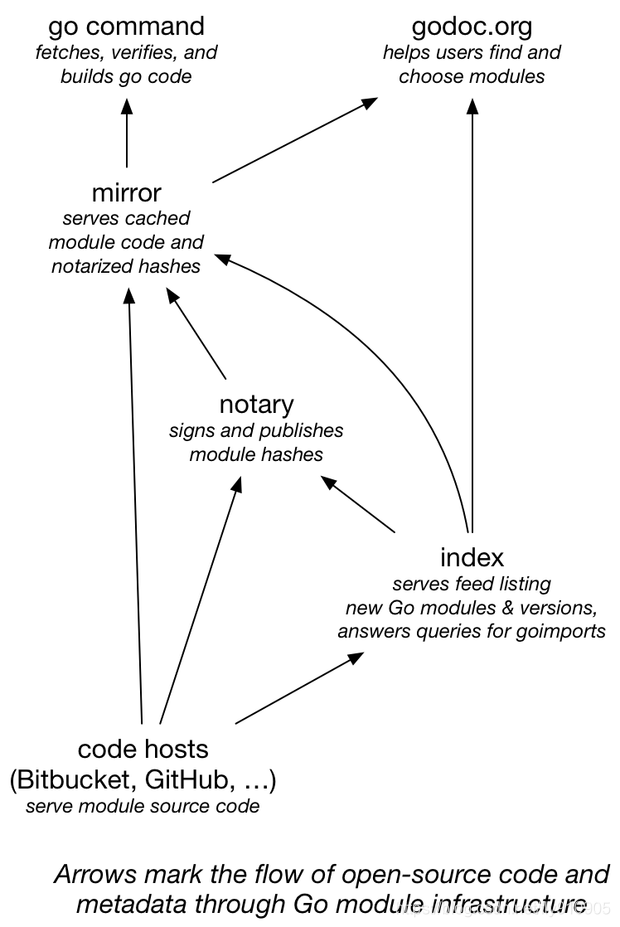

Go模块的发展，经历了以下几个阶段

- GOPATH：在go1.8之前，必须设置这个变量，在 go mod 出现之前，所有的 Go 项目都需要放在同一个工作空间：`$GOPATH/src` 内。

- Vendor：Go 里面没有 maven/npm 之类的包管理工具，**只有一个 `go get`

- Go Modules（Go官方依赖）：去中心化

  - go.mod：记录项目源信息，版本
    - module：定义版本
    - go：记录go的版本
    - require：记录依赖的版本
    - replace：进行依赖的替换，一般用于替换本地的包
    - exclude：排除某个依赖

  

- go.sum：记录go依赖的hash值

## go vendor\dep

使用 `go get` 下载依赖的方式简单暴力，伴随了 Go 七年之久，直到 1.6（2016/02/17）才正式**支持了 [vendor](https://golang.org/doc/go1.6#go_command)，可以把所有依赖下载到当前项目中，解决可重复构建（reproducible builds）的问题，但是无法管理依赖版本**

dep 的定位是实验、探索如何管理版本，并不会直接集成到 Go 工具链，Go 核心团队会吸取 dep 使用经验与社区反馈，开发下一代包管理工具 modules，并于 2019/09/03 发布的 1.13 正式支持，并随之发布 Module Mirror, Index, Checksum，用于解决软件分发、中间人攻击等问题

## go.sum 作用

**Go** 里面没有 **maven/npm** 之类的包管理工具，只有一个 `go get`，没有统一的仓库，支持从**Github**、**Gitlab**、**Gitee** 等各大托管仓库拉取依赖。

若作者将 v1.1版本的代码删除，然后又重新发布了一个新的 v1.1 版本，因为是去中心化，go 是无法感知版本的变更，从而会导致依赖被升级。

所以为了保证每个包的版本不被篡改，所以引入了 go.sum，格式如下所示

当第一次将包引入项目的时候，会校验 go 依赖的版本，并生成hash值，写入到 go.sum

当执行 go mod download 的时候，会通过 hash 值与本地的 go.sum 依赖进行对比

如果一致，才能加载依赖，这样就防范了依赖被篡改，从而对项目造成的风险

同时，项目中的 go.sum 也不能随意篡改，否者容易导致无法正常加载依赖