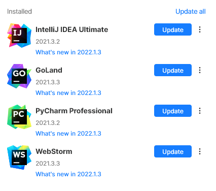
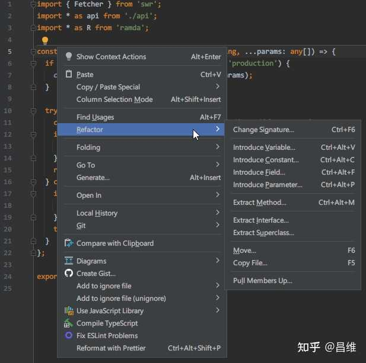
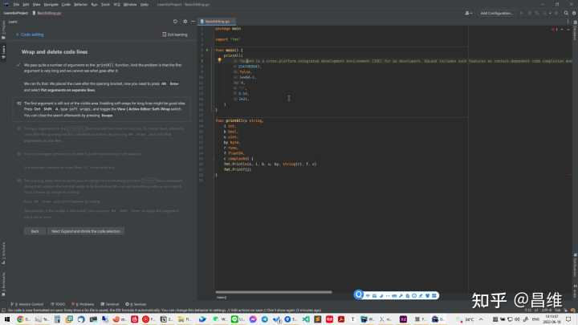
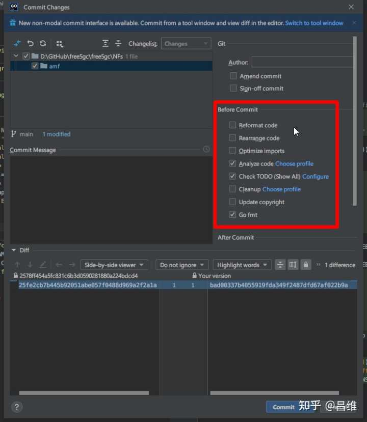

大家好，我是 **陌溪**

之前在学习 **Java** 的时候，使用的是 **Eclipse**，后面接触了 **JetBrains** 的 **IDEA**，也就喜欢上了，然后就给自己电脑上装上 **JetBrains** 全家桶。 

那会我就在想，为什么国内做不出像 **JetBrains** 那样的产品呢？最近，看到一篇知乎文章，解答了我当时的疑惑：

我是一名 **JetBrains** 的忠实粉丝。我学习编程语言的经历大概有 10 年左右，使用 JetBrains 大概有 7 年左右。在这么多年的学习编程和使用 JetBrains 全家桶的过程中，**我认为 JetBrains 的成功不仅仅是技术原因，还有的是产品上面的创新，而这些创新都离不开大型[软件工程]的实战经验，因为只有经历过大型软件工程的开发与不断迭代过程，才知道一款优秀的 IDE 里面需要什么功能，哪些功能能够帮助程序员高效地开软件。**

网传 **JetBrains** 的 **IDEA** 系列最早的“杀手锏”功能是 **refactor** （**rename**）重构功能。例如在 **IDEA** 中你可以使用 **Shift+F6** 快速将一个变量改名，并且这个改名操作将应用到所有 引用了该变量的代码。这就需要 **IDEA** 对整个项目中的所有代码做 **parser**，追踪他们之间的引用关系。这类功能的背后离不开强大的代码静态分析技术。所以做专业软件，首先是需要有技术方面的支持 。

其次是产品方面的设计考量

**IDEA** 的重构功能极为强大，包括各种强大的 **extract**，路径移动等。

**IDEA** 的强大远不如此。它的功能包括但不限于

- 图形化 **debug**
- 图形化 git 操作，一键 **rebase**
- 代码结构梳理，也就是左下角那个 **structure** 功能区（自从用过 **CLion** 之后我在也没用过 **source insight** 了）
- 代码收藏，同样对 **trace code** 友好
- 和各大主流框架和编程语言的紧密结合（例如 **WebStorm** 对 **npm** 有极为强大的支持，能够分析 **scripts** 和 **.nvm** 自动选择合适的 **node.js** 版本启动 **script**，能够自动分析 **node_modules** 判断当前依赖是否匹配 **package.json** 等）
- 最新推出的 **code with me** 功能，在疫情远程工作的大背景下，这个功能能够方便同事之间在无法物理接触的情况下进行手把手 **debug**。
- **generator**（例如 JavaBean 中的 getter setter 方法可以一键生成），也可以配置 **live template** 和 **file template**，例如我写 **React.js** 的时候经常会有很多重复性的样板代码，例如 **const {children} = this.props**，这个我就配置为 **cctp**，我只要按下**cctp** 再按 **tab** 就能快速输入
- 更多功能就不说了

想到以上这些功能的创意，需要 **JetBrains** 的产品经理需要有极长时间的一线 **coding** 经验，并且这些软件工程项目的质量要求很高（如果是[屎山](https://www.zhihu.com/search?q=屎山&search_source=Entity&hybrid_search_source=Entity&hybrid_search_extra={"sourceType"%3A"answer"%2C"sourceId"%3A2534015588})项目，也就没有用到重构功能的必要性），尤其是经历过从 **0** 搭建起一个项目，并且后面又遇到需要重构的情况。

而我国做不出来这类软件，原因也主要有如下

- 有极长 **coding** 经验的人没有国外那么多，大部分是在 **2010** 年之后的互联网红利开始才学习 **coding** 的，甚至很多是[生化环材](https://www.zhihu.com/search?q=生化环材&search_source=Entity&hybrid_search_source=Entity&hybrid_search_extra={"sourceType"%3A"answer"%2C"sourceId"%3A2534015588})转码。**人少，那么诞生出这些天才产品经理的几率也更少**
- 大部分人还是有一种“勤劳的守旧”观念，也就是**认为使用工具提升生产力是一种偷懒和投机取巧的表现**，推崇使用 **vim** 等高门槛和学习曲线陡峭的软件是一种“技术能力强”，“能吃苦学习”的习惯。
- 优秀的产品经理需要**跨界**经验，例如 **JetBrains** 的产品经理肯定不仅仅是画个原型图和写个 **PRD** 那么简单，**这些都需要深入一线软件行业，掌握大量工程师人脉，和非常多的软件工程师交流，了解他们真正需要什么。站在他们的角度思考一款优秀的 IDE 应该要给我带来什么样的功能。**国内 一些 **PM** 论坛的交流内容还是以互联网 **APP** 产品为主，这类产品的 **PM** 还是停留在学校学学 **UI** 设计，出来跟着“人人都是产品经理”的网课，学学做 **PPT** 画原型图写 **PRD** 的水平。**PM** 的上限水平过低，缺乏垂直行业的经验与人脉导致了做不出顶级的工业软件
- 缺乏工程师文化。所谓工程师文化，指的就是产品进步是由工程师推动，工程师使用科学技术提升产品的用户体验，可靠性，安全性等。由于各种环境原因。真正拥有“工程师心态”在人群中还是偏少数，抱有“功利心”去读书刷 **GPA**，去工作刷 **KPI** ，很难诞生优秀的专业软件。**缺乏工程师文化的根本还是和经济基础与分配平衡有关**，经济基础过差的情况下，大家会更容易选择保守，保守则不容易引发对创新的思考。而分配平衡过差，则会导致“工程师”们更倾向于使用“技巧”去内卷抢得少数资源，而非使用“科学技术”去创造更多资源与价值。
- 奶粉钱，[产假](https://www.zhihu.com/search?q=产假&search_source=Entity&hybrid_search_source=Entity&hybrid_search_extra={"sourceType"%3A"answer"%2C"sourceId"%3A2534015588})，房价，教育公平，**没有好的环境就留不住顶尖的工程师与专业的产品经理**，知乎都说烂了的事情就没必要提了。。。

**做工业软件，最好就需要是这个领域的工程师直接转行来做工业软件的产品经理，因为只有自己行业的人才最了解自己人。**而我们的现状是连抱有工程师思想以及拥有工程师文化的公司都非常稀少，更别指望真正的工程师们在拥有丰富经验之后转行 PM ，然后设计优秀的工业软件帮助我们加速生产效率，解放生产力。

最后再谈谈 **JetBrains** 在获客与留存方面做的努力

很多工业软件都有 **help** 帮助文档。但是大家可以扪心自问一下，你们真的有看过专业软件的 **IDE** 吗？你们有点开过专业软件的 **help** 菜单吗？

以 **JetBrains** 家的 **Goland** 为例，当你初次安装时时，首次启动软件会显示引导画面，里面会使用言简意赅的文档和样例代码帮助你快速掌握这款 IDE 的各类 feature

如图所示，这是 **goland** 的 **learn** 功能，而图上此时此刻显示的则是如何使用快捷键快速删除代码行或者换行，以及将过长可变参数的代码自动转换为可读性较强的多行格式

无论是样例代码，还是帮助文档的文案，他们都设计得**言简意赅**，而且即使是英文，也是选择了计算机领域常见的英文单词，不会对非英语母语人士造成太多障碍。

**只有当用户能够很快学习上手你的软件，那么你才能长久留存客户。**而这一点，在我见过的绝大多数驰名全球的顶级专业软件（包括设计领域的 **Adobe** 全家桶，电子工程领域的 **MATLAB**，**Cadance ICC**、**Altium Designer**、**TI** 德州仪器的 **LabView** 和 **Multisim**，**Intel Quartus**，**Xilinx Vivado**）都做得非常差，基本没有像 **JetBrains** 那样提供言简意赅的解释和恰到好处的样例代码让你快速上手。一款专业软件令人难以上手，学习门槛极高，也是很难留存客户的。而 **JetBrains** 在快速入门与帮助文档的细节设计上绝对可以说是优秀至极。

评论区也有人讨论 **vim** 是否适应键盘操作？或者 **vim** 是否有在 **ssh** 上面直接编辑代码这种场景。

首先是键盘适应方面，如果你有深入使用过 **JetBrains**，**其实会发现 IDEA 的纯键盘操作效率并不比vim低，你想要的所有功能都有默认快捷键，没有的话也能自己配置，并且这个配置是云端同步的**，我在公司电脑，自己的 **surface** 平板电脑和家里的游戏机上全平台同步。而且自动完成可以根据自己的 **coding** 领域习惯写自定义 **live template**。最后是 **ctrl+shift+a** 以及 **alt+enter** 几乎可以在任何地方完成绝大部分写代码的常用操作。我并没有觉得 **vim** 在这方面有比JetBrains的效率高多少。

**另外就是 ssh 直接编辑代码这种场景。我认为这种场景是非常危险且不规范的做法**。真正符合工程化的项目都是本地使用 **IDE** 编辑，**IDE** 的静态分析功能帮你检查出可能出错的地方，确认没问题后，用版本控制工具提交，提交过程 **IDEA** 会跑代码格式化，**lint** 规则检查，**import** 优化，清理 **unused** 代码，自动帮你做 **GPG git** 签名，如果是公司或者开源组织机构的项目，还会自动帮你更新 **copyright**，然后做 **TODO** 检测，**code analysis**，**git hook**，最后 **push** 代码后，**CI/CD** 平台开始跑单元测试，集成测试等，全部通过后则自动由 **CI** 平台通过 **SSH** 发布到生产环境。

如果你的代码经常需要直接 **SSH** 连上去直接用 **vim** 修改，没有经过任何工程化工具的前置处理以及 **code review**，那么我只能说你的项目非常不规范，开发这种不规范的项目当然体验不到 **IDE** 能够带来的好处。

