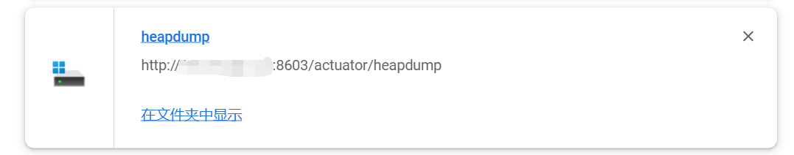

大家好，我是 **陌溪**

前阵子，群里小伙伴发给我一个链接，说蘑菇的配置信息泄漏，要被删库啦！


我一脸黑人问号，随后就看到小伙伴给我发了一个链接地址：

```bash
http://120.78.126.96:8603/actuator/env
```

陌溪用浏览器打开，显示一大串的信息


用 **Json** 格式化工具，格式后发现，里面就是蘑菇的 **application.yml** 配置信息！


往下翻了翻，找到数据库的账号和密码。还好没有直接将密码直接明文显示，竟然良心的加了掩码


但是小伙伴以为上面这样就安全了么？


继续扒开 /actuator 目录下的内容，可以看到除了 **env** 外，还有其它的信息

```bash
/actuator/env      # 提供对配置环境的访问
/actuator/beans    # 描述应用程序上下文里全部的Bean
/actuator/health   # 报告应用程序的健康指标
/actuator/info     # 获取应用程序的定制信息
/actuator/trace    # 显示最后几条HTTP消息
/actuator/logfile  # 输出日志文件的内容
/actuator/heapdump # 堆栈快照
...
```

其中有意思的是 **/actuator/heapdump** 堆栈快照

## 什么是堆栈文件？

**heapdump** 文件是一个二进制文件，它保存了某一时刻JVM堆中对象使用情况。**heapdump** 文件是指定时刻的**Java** 堆栈的快照，是一种镜像文件。

**Heap Dump** 中主要包含当生成快照时堆中的 **Java** 对象和类的信息，主要分为如下几类：

- 对象信息：类名、属性、基础类型和引用类型

- 类信息：类加载器、类名称、超类、静态属性
-  **GC Roots**：**JVM** 中的一个定义，进行垃圾收集时，要遍历可达对象的起点节点的集合
- 线程栈和局部变量：快照生成时候的线程调用栈，和每个栈上的局部变量

我们使用访问 **/actuator/heapdump**  获取到堆栈快照文件

```bash
http://159.75.68.124:8603/actuator/heapdump
```

下载的时候，这个文件还是比较大的，大概有 **100** 多 **MB**



下载完成后，需要使用专门的工具（ **heapdump_tool.jar** ）才能打开

```bash
下载地址：https://toolaffix.oss-cn-beijing.aliyuncs.com/wyzxxz/20220720/heapdump_tool.jar
```

> **声明**： 此工具仅用于企业安全人员自查验证自身企业资产的安全风险，或有合法授权的安全测试，请勿用于其他用途，如有，后果自负。

下载完成后，将工具以及刚刚的堆存储文件放一起


然后使用下面命令，读取堆栈快照

```bash
java -jar heapdump_tool.jar  heapdump
```

然后会提示进行模式选择，有两个选项

- **0**：搜索数据，可能找不到某些数据，并且不能使用 num 和 len 函数
- **1**：加载所有的对象，需要等待几分钟


我们就输入 **0**，开始搜索数据

找到之前加了掩码的Key，即：**spring.security.user.password**，也就是下图的内容


输入完成后，可以看到我们的数据库密码，直接被打印出来了！


同时在测试一下 **Redis** 的密码：**spring.redis.password** 也直接展示出来了


直接使用 **SQLLog** 连接到数据库，蘑菇数据内容一览无遗，直接就芭比Q了


## 漏洞原因

**Actuator** 是 **SpringBoot** 提供的用来对应用系统进行自省和监控的功能模块，借助于 **Actuator** 开发者可以很方便地对应用系统某些监控指标进行查看、统计等。

在 **Actuator** 启用的情况下，如果没有做好相关权限控制，非法用户可通过访问默认的执行器端点（**endpoints**）来获取应用系统中的监控信息，从而导致信息泄露甚至服务器被接管的事件发生。

如上所示，**actuator** 是 **springboot** 提供的用来对应用系统进行自省和监控的功能模块。其提供的执行器端点分为两类：原生端点和用户自定义扩展端点，原生端点主要有：


也就是说，只要你使用的 **SpringBoot** 框架，并且添加了 **Actuator** 依赖，就可能有这个问题。

比如，蘑菇之前引入 **SpringSecurity** 配置的时候，直接从网上 **Copy** 了一份配置，把所有的内容允许匿名访问给开放放出去了，也给自己网站的安全问题造成隐患。


##  解决方法

可以直接在配置文件中，排除掉存在危险的端点，比如把：**env**，**beans**，**heapdump** 排除

```bash
management:
  endpoints:
    web:
      exposure:
        include: "*"
        exclude: env,beans,heapdump
```

这样在访问  **/actuator/env** 地址的时候，就会访问不了的


另外，就是在 **SpringSecurity** 配置文件处，不能用 **/actuator/**** 让所有都匿名访问，而是配置不敏感的请求，允许匿名访问

而对于敏感的地址，我们需要验证 **SpringSecurity** 的账号和密码，如下所示，我们只允许访问以下几种方法


配置完后，再次访问就会出现访问拒绝了，这样也杜绝了泄漏堆栈快照的问题。


如果访问配置允许匿名访问的接口，也还是可以拿到配置信息的

